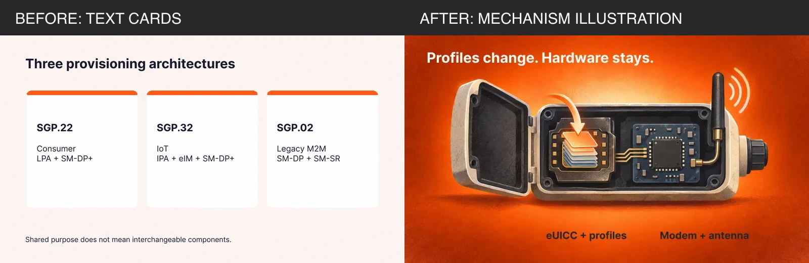
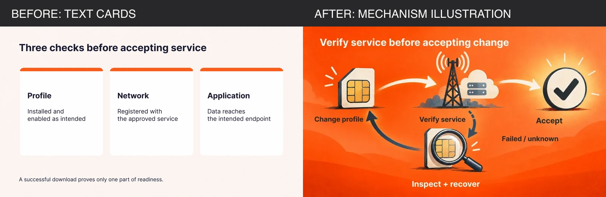

# M01 body-image direction review

24 September 2026. Only M01 was reworked. The user requested a before/after direction check before work on the other 30 previews. No other cluster, hero, published media reference, author or information-gain score changed.

## Honest inventory decision

|Old generated body image|Decision|Where its information now lives|
|---|---|---|
|rsp-architectures.png and .webp|DROP both files. Three text cards duplicate a comparison, with no visible component relationship.|The existing four-column HTML architecture table already contains all three specification families, their device/server roles and selection questions. It remains unchanged; adding another table would duplicate it.|
|rsp-acceptance.png and .webp|DROP both files. The three checks are a text table rather than an illustration.|A new accessible two-column HTML table reproduces Profile, Network and Application with their original required outcomes, plus the original takeaway.|

The rejected files are deleted from public/blog-media, not left shipping unreferenced. Before images are retained only as review composites in this documentation directory and in Git history.

## New illustrations and why each earns its place

|File, with matching WebP|Visible relationship|Editorial purpose|
|---|---|---|
|rsp-profile-hardware-cutaway.png|A profile enters the eUICC inside one opened device; a separate modem connects to its antenna.|Spatial nesting distinguishes remotely changed credentials from unchanged radio hardware. The architecture table cannot communicate this physical distinction as quickly. Conceptual, not a literal product schematic.|
|rsp-service-recovery-loop.png|The service check branches toward acceptance or down through inspection/recovery before returning to the change workflow.|The loop makes an exception path visible. It supplements the acceptance table, which lists outcomes but cannot show branching. The caption says recovery depends on the supported implementation; no automatic rollback is promised.|

Both use a full orange colour field, recognizable objects per concept, visible spatial/flow relationships, grain, focal glow and shadow sides. Neither is an outlined text card. The cutaway is placed in the components section; the recovery loop follows the existing recovery guidance. M01 retains three body figures: these two and the unchanged published bootstrap illustration. Its published hero is unchanged.

Artwork was generated using the built-in image_gen tool. Labels were separately typeset in Inter Bold in Figma, file QYBV0dwgiLrqR4PP6RpgP6, frames 55:2 and 55:6. The image-upload endpoint timed out, so transparent typography exports were composited with the generated frames. Exact prompts are in M01-body-image-prompts.md. Labels use 36 to 56px at 1600px, below 40 words in each image.

## Before and after

The left side is the rejected text-card image. The right side is the useful mechanism illustration now occupying that visual role; the old card information is retained in HTML as described above.

## Verification

- `npm run merge:qa -- M01`: PASS, with four HTML tables and three body figures. No gate changes or exceptions.
- `npx astro check`: 0 errors, 0 warnings, 72 existing hints.
- Existing article paragraphs, headings, lists and original tables were compared verbatim and preserved. Changes are limited to image figures/captions and the replacement acceptance table and its source line.
- Published body-image markup including its URL/srcset remains byte-identical. The preview manifest and every hero file are unchanged.
- Both new PNGs and WebPs are 1600x900. Optimized PNGs were inspected at 1024px; labels remain legible, crop is intact and colour transitions retain texture. An over-quantized test was rejected. The higher-quality 256-colour PNG fallbacks exceed the old 600KB heuristic because of full-frame grain; WebP is the normal browser payload.
- The recovery label initially crossed an arrow; it was repositioned and the final output inspected.
- Browser verification confirms both new files select WebP at 1600x900. All three body images load. At 390px the document remains 390px wide and all four tables scroll internally. Native FAQ behaviour remains intact.
- CSS optimization completed. Unrelated baseline bundle changes were excluded.
- Updated reading count: 2,342 body + 142 TL;DR = 2,484 words. Information gain remains 7; outstanding evidence requests remain unchanged.

## File sizes

|Asset|PNG bytes|WebP bytes|
|---|---:|---:|
|rsp-profile-hardware-cutaway|802,297|114,742|
|rsp-service-recovery-loop|858,823|133,110|

Status: M01 direction sample complete; await user confirmation before the remaining 30 clusters. No push or publication.
